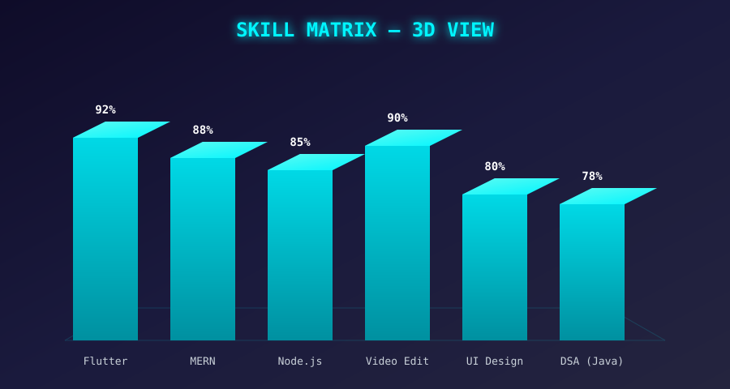
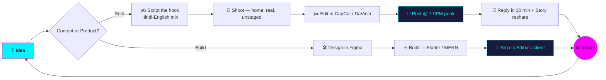

<div align="center">

<!-- ANIMATED GRADIENT BANNER (NEW STYLE) -->


<!-- FLOATING TECH ICONS (NEW) -->


<br/><br/>

<!-- MULTI-LINE TYPING ANIMATION -->
<a href="https://git.io/typing-svg">
  
</a>

<br/>

<!-- PROFILE BADGES -->


[](https://leetcode.com/u/pradhummandil/)

<br/>

[](https://instagram.com/)
[](https://pradhummandil.framer.ai/)
[](https://github.com/pradhummandil)
[](https://linkedin.com/in/pradhum-m-b69b66318)

<!-- ANIMATED WAVING HAND GIF (NEW) -->


</div>

---

## 📸 About Me

<table>
<tr>
<td width="30%" align="center">

</td>
<td width="70%" valign="top">

**Pradhum Mandil** — Full-stack & Flutter developer, freelancer, and founder of **Adihat**. I also create storytelling-style Instagram Reels for a young Indian audience under **@heymandil__**, and co-run the **India Story Project** with Mayank Sahu.

By day: shipping Adihat's 8-portal healthcare ecosystem and freelance apps/websites.
By night: scripting reels, editing in CapCut/DaVinci, and grinding DSA in Java.

</td>
</tr>
</table>

<sub>Commit your real photo to <code>assets/pradhum.png</code> in the <code>pradhummandil/pradhummandil</code> repo for this to render.</sub>

---

## 🧬 `whoami`

```yaml
name: "Pradhum Mandil"
role: "Instagram Reels Creator × Full-Stack & App Developer × Designer"
based_in: "India 🇮🇳"
building:
  - "Adihat — a startup product I'm building end-to-end"
  - "Freelance app, web, video & design services"
focus:
  - Crafting viral, story-driven Reels (Hindi-English mix)
  - Designing & building mobile apps (Flutter) and websites (MERN)
  - Video editing & visual design for brands and creators
  - Sharpening problem-solving through daily DSA practice (Java)
currently:
  - Growing a Reels channel around relatable, home-shot storytelling
  - Shipping Adihat as part of my startup journey
  - Taking freelance projects for app design, web design & video editing
fun_fact: "I script emotional hooks the same way I debug code — find the one line that changes everything."
```

<div align="center">

</div>

---

## 🎬 Featured Reels (NEW)

<div align="center">

| | | |
|:---:|:---:|:---:|
| [](https://instagram.com/heymandil__) | [](https://instagram.com/heymandil__) | [](https://instagram.com/heymandil__) |

**[@heymandil__](https://instagram.com/heymandil__)** — storytelling reels, relatable & motivational content for a young Indian audience

</div>

<sub>GitHub can't autoplay video in READMEs, so these are click-through cards. Swap each link for your specific reel URL, and optionally replace the badge image with an actual thumbnail frame from the reel (screenshot it and save to <code>assets/reel-1.png</code> etc., then use a normal <code>&lt;img&gt;</code> tag linking out with <code>&lt;a href=...&gt;</code>).</sub>

---

## 🚀 Featured Project — Adihat

<div align="center">

</div>

<table>
<tr>
<td width="70%" valign="top">

**Adihat** is a startup product I'm building — bringing together my app development, design, and content-strategy skills into one venture. Currently in active development.

</td>
<td width="30%" align="center" valign="top">

`🔨 In Development`
<br/>
`🚀 Startup`

</td>
</tr>
</table>

---

## 💼 Freelance Services

<div align="center">

### 🔗 [pradhummandil.framer.ai](https://pradhummandil.framer.ai/)

| Service | What I Offer |
|---|---|
| 📱 **App Design & Development** | Flutter-based Android apps — UI design to deployment |
| 🌐 **Website Design & Development** | MERN stack websites — fast, responsive, production-ready |
| 🎬 **Video Editing** | Reels, brand videos, promotional content |
| 🎨 **Graphic & UI/UX Design** | App interfaces, social media creatives, brand visuals |

</div>

---

## 🎯 What I'm Building

<table>
<tr>
<td width="50%" valign="top">

### 📱 Content Engine
- Storytelling scripts with universal emotional hooks (comeback arcs, silent-grind themes, relatable pressure)
- Everyday, home-shot visuals that feel real, not staged
- Low-friction CTAs (one word, one number) to spark comments
- Posting tuned to Indian scroll-peak windows (7–9 PM / 7–8 AM)
- Replying to comments within the first 30 minutes, resharing to Stories instantly

</td>
<td width="50%" valign="top">

### 🛠️ Tech & Design Side
- Building **Adihat**, my startup app
- Android apps with **Flutter** & Android Studio
- Full-stack websites using the **MERN** stack
- Video editing & graphic design for freelance clients
- Documenting the playbook as I iterate

</td>
</tr>
</table>

---

## 📈 3D Skill Matrix

<div align="center">

</div>

<sub align="center">Custom isometric render — commit <code>assets/skills-3d.svg</code> to this repo for it to display.</sub>

---

## 🔄 How I Work — Content × Code Pipeline



---

## 🌌 3D Contribution Graph

<div align="center">

</div>

<sub align="center">Rendered automatically by the <code>yoshi389111/github-profile-3d-contrib</code> GitHub Action — see the ⚙️ setup note at the bottom of this README.</sub>

---

## ⌨️ Live From My Desk

<div align="center">

&nbsp;&nbsp;

</div>

---

## 🧠 DSA Journey

<div align="center">


</div>

**Strong topics:** Array &nbsp;·&nbsp; Math &nbsp;·&nbsp; Hash Table
**Language:** Java &nbsp;·&nbsp; **Range:** Easy → Hard, across DP, Graphs, and Number Theory

---

## ⚡ Tech Stack

<div align="center">


</div>

---

## 📊 GitHub Stats

<div align="center">


</div>

<div align="center">

</div>

<div align="center">

</div>

<div align="center">

</div>

---

## 🐍 Contribution Snake Game

<div align="center">

</div>

> ⚙️ Auto-updates every 12 hours via GitHub Actions — the snake "eats" my contribution graph.

---

## 💻 Random Dev Quote

<div align="center">

</div>

---

## ⚙️ Setup Notes (delete this section once done)

<details>
<summary><b>How to activate the 3D Contribution Graph</b></summary>

<br/>

1. In `pradhummandil/pradhummandil`, go to **Actions → New workflow → set up a workflow yourself**.
2. Paste this workflow and commit it as `.github/workflows/profile-3d-contrib.yml`:

```yaml
name: 3D Profile Contribution Graph

on:
  schedule:
    - cron: "0 0 * * *"
  workflow_dispatch:

jobs:
  build:
    runs-on: ubuntu-latest
    steps:
      - uses: yoshi389111/github-profile-3d-contrib@0.7.1
        env:
          GITHUB_USER_NAME: pradhummandil
        with:
          username: pradhummandil
      - name: Commit & push
        run: |
          git config user.name github-actions
          git config user.email github-actions@github.com
          git add -A .
          git commit -m "Update 3D contribution graph" || exit 0
          git push
```

3. Run it once manually (**Run workflow**) — it generates SVGs under `profile-3d-contrib/`, which is what the section above already points to.

</details>

<details>
<summary><b>How to activate the Snake Game</b></summary>

<br/>

Same idea — add the official <code>Platane/snk</code> action if not already running; it writes to the `output` branch this README already references.

</details>

<details>
<summary><b>3D Skill Matrix image</b></summary>

<br/>

Commit the provided <code>assets/skills-3d.svg</code> file to the root of this repo — the section above references it as a relative path so it renders automatically once pushed.

</details>

<details>
<summary><b>About Me photo & Featured Reels</b></summary>

<br/>

Commit your real photo as <code>assets/pradhum.png</code>. For Featured Reels, replace the three placeholder Instagram links with the direct URLs of your best-performing reels.

</details>

---

## 🌐 Let's Connect

<div align="center">

[](https://instagram.com/heymandil__)
[](https://pradhummandil.framer.ai/)
[](https://github.com/pradhummandil)
[](https://linkedin.com/in/pradhum-m-b69b66318)
[](https://leetcode.com/u/pradhummandil/)

</div>

<div align="center">

</div>

<div align="center">
<sub>⭐ Thanks for scrolling this far — just like a good Reel, hope it kept you hooked till the end.</sub>
</div>
